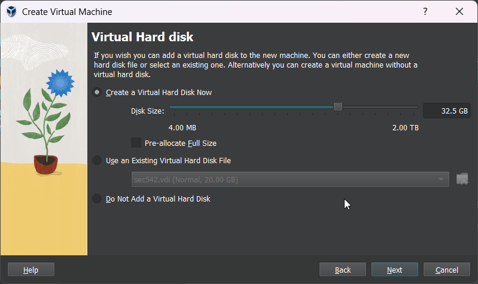
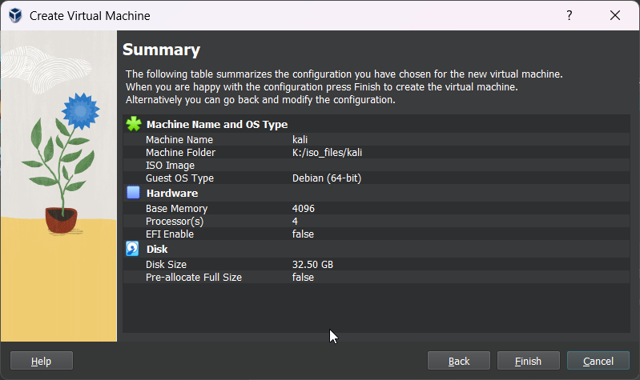
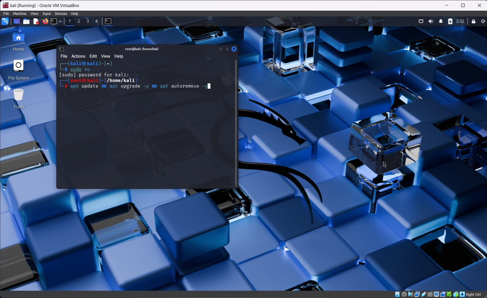
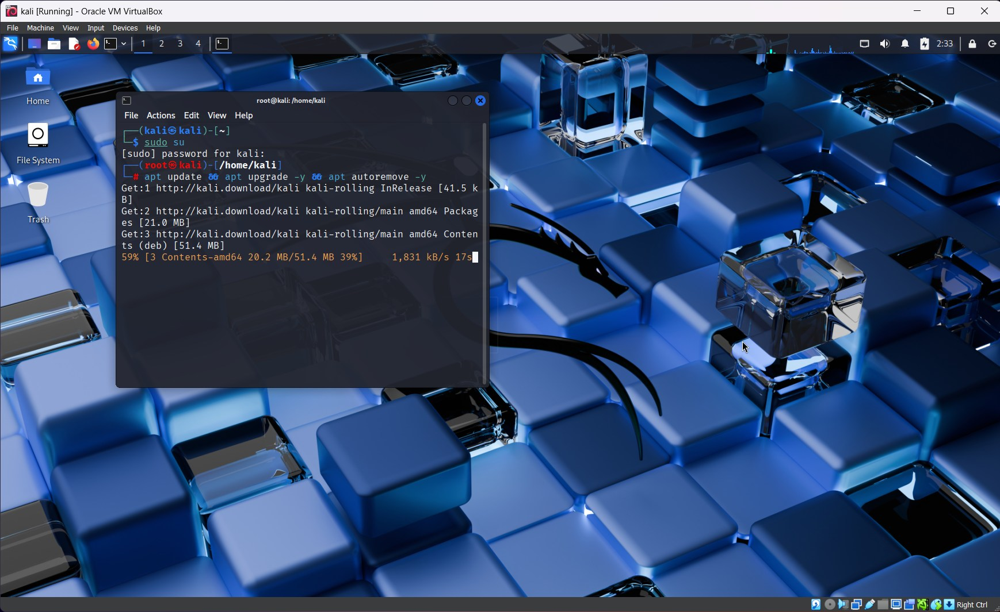

# 🐱‍💻 Kali Linux Installation Guide (VirtualBox on Windows)

> ⚡ A beginner-friendly, step-by-step guide to install and set up Kali Linux on VirtualBox using a Windows machine. Includes screenshots for every step.

---

### ✅ 1. Download Required Files

- **Download VirtualBox for Windows:**\
  [https://www.virtualbox.org/wiki/Downloads](https://www.virtualbox.org/wiki/Downloads)

- **Download Kali Linux VirtualBox Image (ZIP):**\
  [https://www.kali.org/get-kali/#kali-virtual-machines](https://www.kali.org/get-kali/#kali-virtual-machines)

---

### ⚙️ 2. Set Up the Virtual Machine

1. **Open VirtualBox and click **New** to create a new VM:**\


2. **Enter a name, select machine folder, choose **Linux** as Type, and **Debian (64-bit)** as Version:**\


3. **Allocate RAM and processors** (Minimum: 2 GB RAM, 2 CPUs):\


4. **Create a virtual hard disk** (Minimum: 20 GB. Recommended: 35–40 GB for tools and bug bounty utilities):\



5. **Click **Finish** to create the virtual machine:**\



---

### 🔧 3. Attach the Kali Linux Disk Image

6. **Click on the new VM and open its **Settings** by pressing right click on new VM:**\


7. **Go to **Storage section** > click the empty SATA slot > choose a disk file:**\


8. **Browse and select the extracted **.vdi** file from the Kali Linux ZIP:**\


### 🚀 4. Start and Log In to Kali Linux

9. **Double-click the VM to start Kali Linux.**\
   Default credentials:
   - Username: `kali`
   - Password: `kali` 


### 🛠️ 5. Update the Kali Linux System

10. **Open Terminal** (`Ctrl + Alt + T`) and run the following command:

```bash
sudo apt update && sudo apt upgrade -y && sudo apt autoremove -y
```



This updates all installed packages to their latest versions and removes unnecessary ones.



---

### ✅ 6. Done! Kali Linux is Ready to Use

11. **You now have a fully functioning Kali Linux setup on VirtualBox.**\
    Start exploring, installing tools, or begin your ethical hacking journey!\


---

### 🙌 Tips

- Always keep your system updated.
- Take snapshots after installing important tools.
- Disable sleep/lock settings to keep your VM always awake (if needed).

---